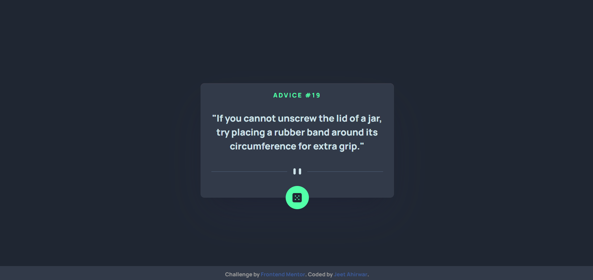
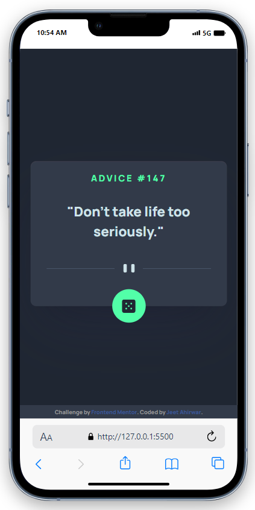

# Frontend Mentor - Advice generator app

This is a solution to the [Advice generator app challenge on Frontend Mentor](https://www.frontendmentor.io/challenges/advice-generator-app-QdUG-13db). Frontend Mentor challenges help you improve your coding skills by building realistic projects.

## Table of contents

- [Overview](#overview)
  - [The challenge](#the-challenge)
  - [Screenshot](#screenshot)
  - [Links](#links)
- [My process](#my-process)
  - [Built with](#built-with)
  - [What I learned](#what-i-learned)
  - [Continued development](#continued-development)
  - [Useful resources](#useful-resources)
- [Author](#author)
- [Acknowledgments](#acknowledgments)


## Overview

### The challenge

Users should be able to:

- View the optimal layout for the app depending on their device's screen size
- See hover states for all interactive elements on the page
- Generate a new piece of advice by clicking the dice icon


### Desktop Screenshot



### Mobile Screenshot
<div style="display: flex; align-items: center;">
  
<div>     

 ### Links

  Solution URL: [Click Here](https://github.com/JEETAHIRWAR/advice-generator-app) </br>
  Live Site URL: [Click Here](https://jeetahirwar.github.io/advice-generator-app/)

 ## My process

 ### Built with


  <pre style="background-color: #2D3250; color: #DCF2F1; font-weight: 600; font-family: 'Manrope', sans-serif; font-size: 16px; padding: 10px;">
  - Semantic HTML5 markup
  - CSS custom properties
  - Flexbox
  - CSS Grid
  - Mobile-first workflow
  - JavaScript
  - Fetch API for data retrieval
  - Responsive design
  - Box shadows for enhanced styling
</pre>


  </div>
</div>


### What I learned

During this project, I learned how to use the Fetch API to retrieve data from an external source and update the content dynamically on the webpage. I also improved my skills in responsive design, incorporating box shadows, and creating interactive elements.


### Continued development

I plan to continue refining my skills in JavaScript, especially in handling asynchronous operations and improving the overall user experience. Additionally, I aim to explore more advanced styling techniques and experiment with different design patterns.

### Useful resources
- [MDN Web Docs - Fetch API](https://developer.mozilla.org/en-US/docs/Web/API/Fetch_API): Comprehensive guide on using the Fetch API.
- [CSS Tricks - Box Shadows](https://css-tricks.com/almanac/properties/b/box-shadow/): A handy reference for creating box shadows.
- [Frontend Mentor](https://www.frontendmentor.io/challenges/advice-generator-app-QdUG-13db): The challenge description and community feedback.


## Acknowledgments

I'd like to thank Frontend Mentor for providing this challenging project and the supportive community that offers valuable feedback and insights. Additionally, I appreciate the resources from MDN Web Docs and CSS Tricks that contributed to my learning process.

---

<div align="right">
  
## Author
   [JEET AHIRWAR](https://github.com/JEETAHIRWAR)
- Frontend Mentor - [@jeetahirwar](https://www.frontendmentor.io/profile/JEETAHIRWAR)

</div>

---

## Like my work and want to support me?

Feel free to connect with me on LinkedIn:

[](https://www.linkedin.com/in/jeet-ahirwar-0b71371b2/)
[](https://www.your-portfolio-website.com/)
[](https://www.twitter.com/jeet_05404201)
[](https://www.instagram.com/_jeet__007_/)

If you find the Quiz Web App helpful and would like to support my work, you can do so in the following ways:

1. **⭐Star this Repository:** If you like this project, show your appreciation by starring the GitHub repository. Your stars help others discover and benefit from this project as well.

2. **📢Feedback and Contributions:** I welcome feedback, bug reports, and contributions. If you have suggestions, ideas, or want to contribute code, please create issues or pull requests on GitHub.

3. **💬Share with Others:** If you find this app useful, consider sharing it with friends and colleagues who might also benefit from it.

4. **
Follow Me:** Stay updated with my latest projects and contributions by following me on GitHub.

Your support is greatly appreciated and helps me improve and create more useful projects in the future.

---
## Contributing
- **Fork the Repository**: Click the "Fork" button at the top right of the repository on GitHub.
- **Clone the Repository**: Clone the forked repository to your local machine using Git.
 
   ```bash
   git clone https://github.com/JEETAHIRWAR/quiz_app.git


- **Create a Branch**: Create a new branch to work on your feature or bug fix.

  ```bash
   git checkout -b feature/your-feature-name


- **Make Changes**: Make your desired changes to the codebase.
- **Commit Changes**: Commit your changes with a descriptive commit message.

  ```bash
  git commit -m "Add your commit message here"


- **Push Changes**: Push your changes to your forked repository.

  ```bash
  git push origin feature/your-feature-name


- **Open a Pull Request**: Go to the original repository on GitHub and click the "New Pull Request" button. Follow the prompts to create your pull request.
- **Discuss and Review**: Participate in the discussion with the project maintainers. Make any necessary changes to your pull request based on feedback.
- **Merge Pull Request**: Once your pull request is approved, it will be merged into the main project.

Thank you for your contributions!

Please review our Code of Conduct before contributing and follow the best practices for code quality and style.

We appreciate your help in making the Quiz Web App even better. 🚀

---

<div>
<h3 align="center">❤️Thank You 😎</h3>

<div align="center">
  <p>😊Thank you for checking out my project!</p>
  
  <h4>👻 Happy Coding </h4>
  <p>🥳Your support means a lot to me. If you have any questions or feedback, feel free to reach out.</p>
</div>

</div>

----
----

